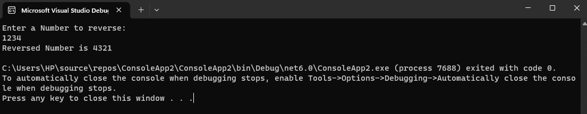

# Recursive-function

## Aim: To write a C# program to reverse a number using recursive function.

## Algorithm:
## Step 1:
Create a function for reversing.
## Step 2:
Get the number from the user.
## Step 3:
In the function find reminder of the number and multiply it by 10 and add the reverse number.
## Step 4:
Recusively call this function to get the reversed number.
## Step 5:
Print the reversed number.

## Program:
```
NAME : POOJITHASETTY
REG_NO : 212221240050

using System;
namespace reverse
{
    class program
    {
        int rem, rev = 0;
        public int numRev(int num)
        {
            rem = num % 10;
            if (rem == 0)
            {
                return rev;
            }
            else
            {
                rem = num % 10;
                rev = rev * 10 + rem;
                return numRev(num / 10);

            }

        }
        static void Main(string[] args)
        {
            int n;
            Console.WriteLine("Enter a Number to reverse: ");
            n = Convert.ToInt32(Console.ReadLine());

            program p1 = new program();
            Console.WriteLine("Reversed Number is " + p1.numRev(n));
        }
    }
}
```

## Output:


## Result:
C# program to reverse a number using recursive function is executed successfully.
